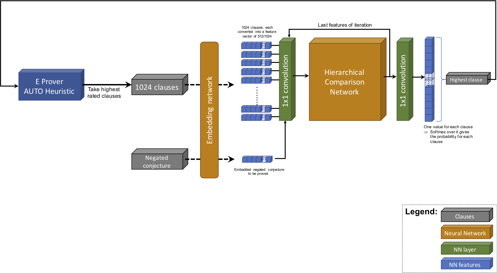

# DeepReasoning
This repository contains various models for the first-order logic theorem prover [E](http://wwwlehre.dhbw-stuttgart.de/~sschulz/E/E.html) using deep neural networks. 
It is separated by
- Embedding networks, that take a single clause and try to embed it into a feature vector or single value.
- Comparison networks, that take multiple embedded clauses and rate them by comparison. 
## Embedding networks
### CNN Embedder
The CNN Embedder is based on [Deep Network Guided Proof Search](https://arxiv.org/abs/1701.06972)_(S.Loss et al, 2017)_.
All terms of a clause are embedded in a feature vector with a channel size of 1024 and processed by three 
one-dimensional convolutions. Using a max pool over channels reduces the output tensor to a fixed size, independent of 
the clause size. These tensors are used as the final clause embedding. 

To get a prediction with respect to the negated conjecture, that should be proved by E, it is embedded using the same way 
as it done for the clauses. Finally the clause tensors are concatenated with the one for the negated conjecture and
processed by two fully connected layers resulting in a single value between 0 and 1. That is the final predicted 
probability with that the clause will help to prove the conjecture.
 

## Comparison networks
### WaveNet
The WaveNet model is structured as follows: 

